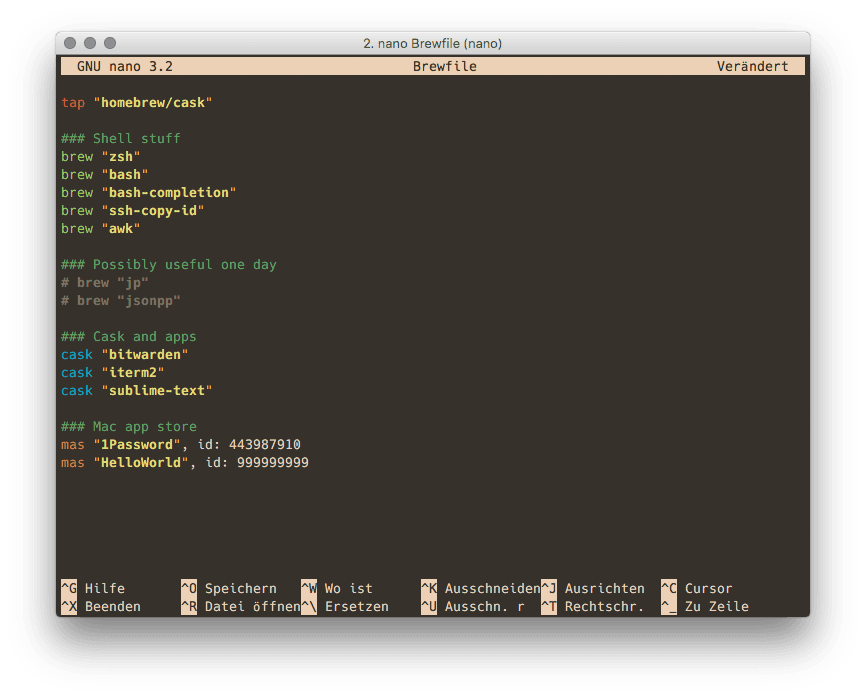

# Brewfile · Nano Syntax Highlighting File

**Simple Nano syntax highlighting file for Brewfiles.**

## Installation

First, clone the repo. Copy the **Brewfile.nanorc** into your `~/.nano/` directory.

```
$ git clone https://github.com/tomkyle/nanorc-brewfile.git
$ cp nanorc-brewfile/Brewfile.nanorc ~/.nano/
```

Second, add the file to your **~/.nanorc** configuration file 

```
## Brewfile
include "~/.nano/Brewfile.nanorc"
```


